<a href="https://github.com/chxrpucf/chxrpucf.github.io" class="btn btn-github"><span class="icon"></span>View on GitHub</a>

Text can be **bold**, _italic_, ~~strikethrough~~ or `keyword`.

[Link to another page](./another-page.html).

There should be whitespace between paragraphs.

There should be whitespace between paragraphs. We recommend including a README, or a file with information about your project.

# Installing and Configuring a Virtual Network

## Project Overview: SAVN.local Virtual Network Implementation

"SAVN.local" is a virtual private network (VPN) designed for a fictitious company called System Administration Virtual Network Company (SAVN). As the company’s system administrator, I am responsible for designing and implementing this network. SAVN’s network infrastructure will be built using Microsoft technologies, specifically Windows Server 2022 for servers and Windows 10 for desktop environments.

The project involves the following key components:

Virtualization: The entire network setup is virtualized. We have two virtual servers and one virtual desktop. These machines communicate over a local virtual network switch, with my physical computer acting as the network switch.

Domain Controller (CMB-SP24-S22-1): This server manages the SAVN.local domain using Active Directory Domain Services (AD DS) and DNS. It is responsible for locating network resources and controlling access to them.

Application and File Server (CMB-SP24-S22-2): This server stores and manages applications and data files centrally, allowing other networked computers to access these resources.

Virtual Desktop (CMB-SP24-W10-1): This client machine runs Windows 10 and accesses system resources such as folders and files on the network file server.

Through this project, I will configure IP settings, implement centralized and secure management of the network, and ensure all components work seamlessly together to support SAVN’s operations.
### AD DS AND DNS ROLES INSTALLED

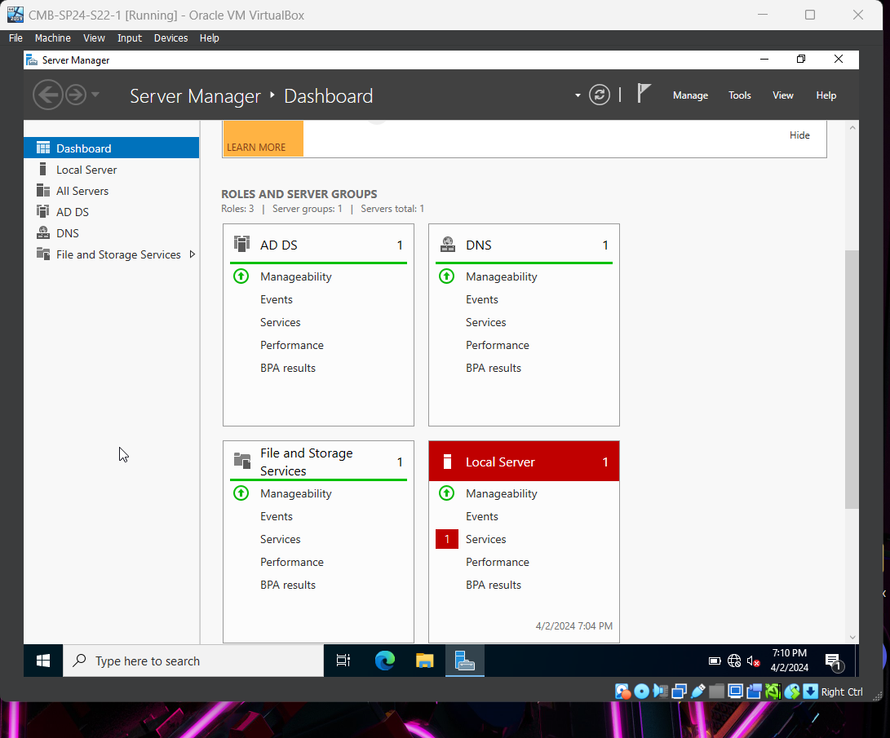


### CMB-SP24-S22-1 in savn.local domain

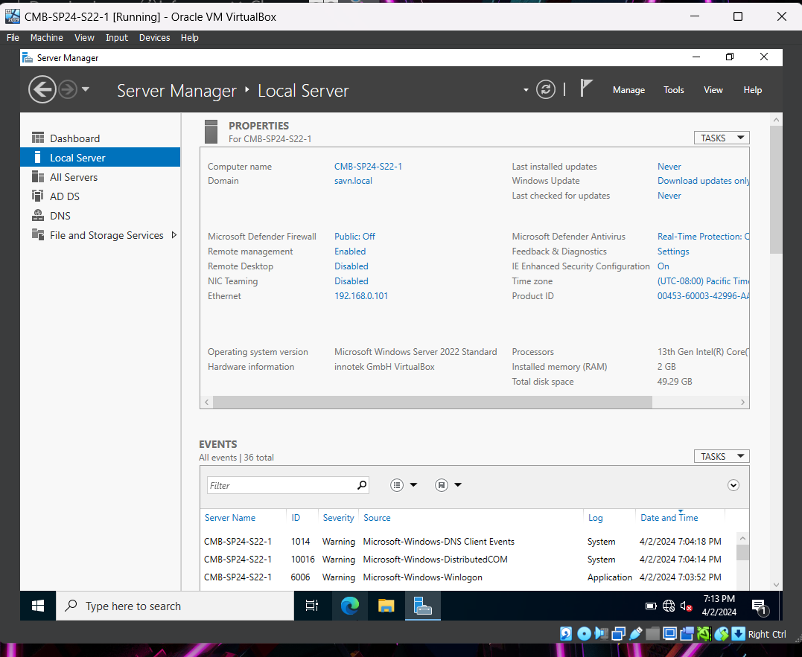


### CMB-SP24-S22-1 set as domain controller for savn.local

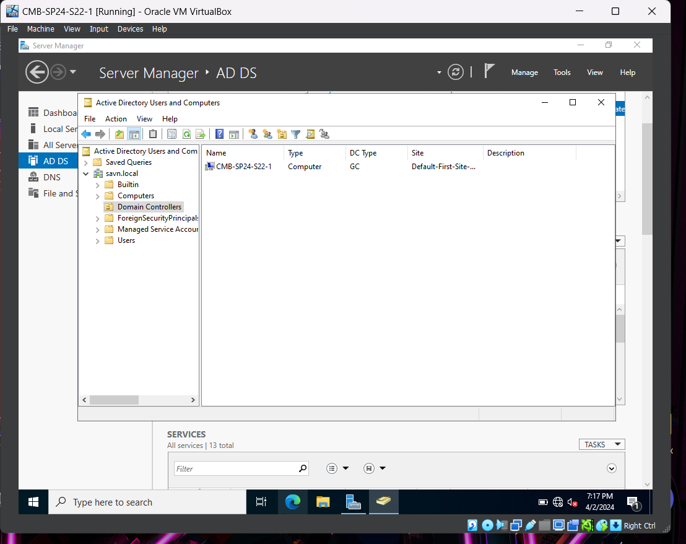


### CMB-SP24-S22-2 joins savn.local domain
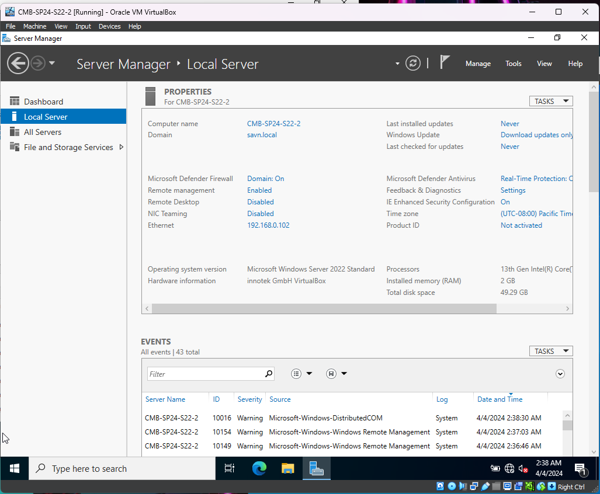


### CMB-SP24-W10-1 joins savn.local domain
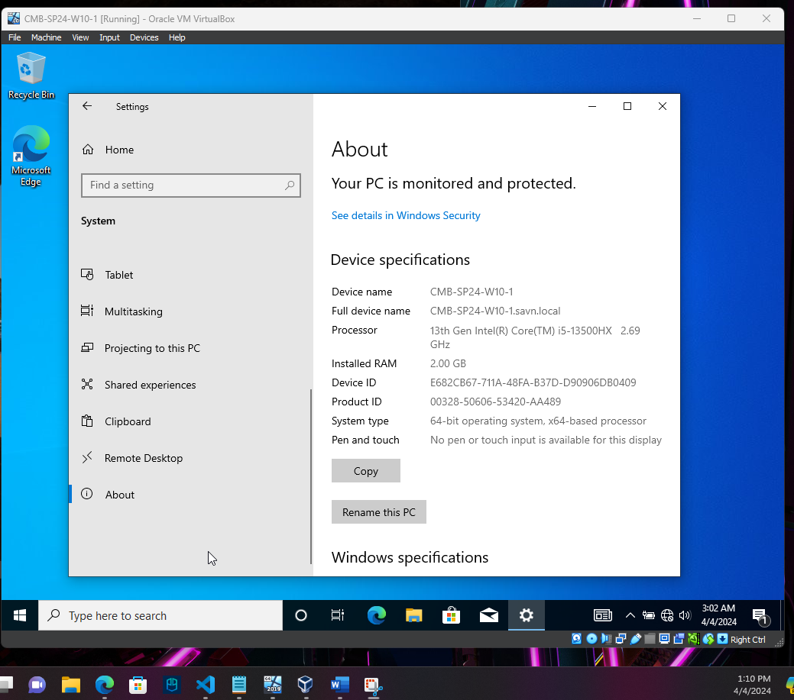


### Computers in savn.local Active Directory
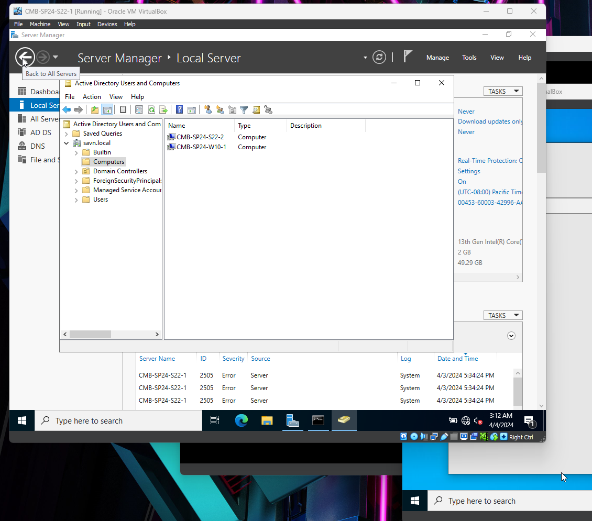


### Ping CMB-SP24-S22-1
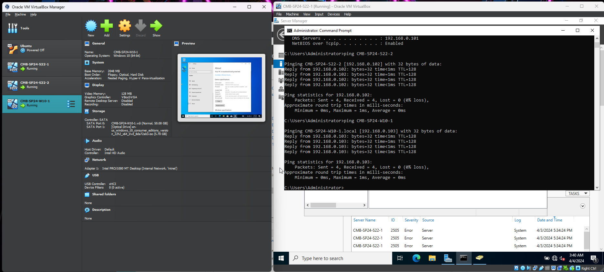


### Ping CMB-SP24-S22-2
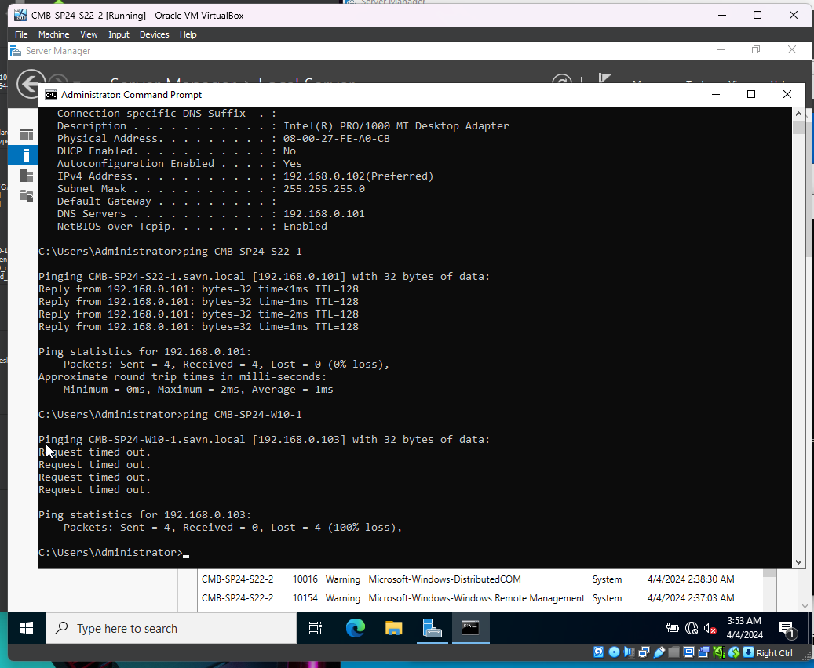


### Ping CMB-SP24-W10-1
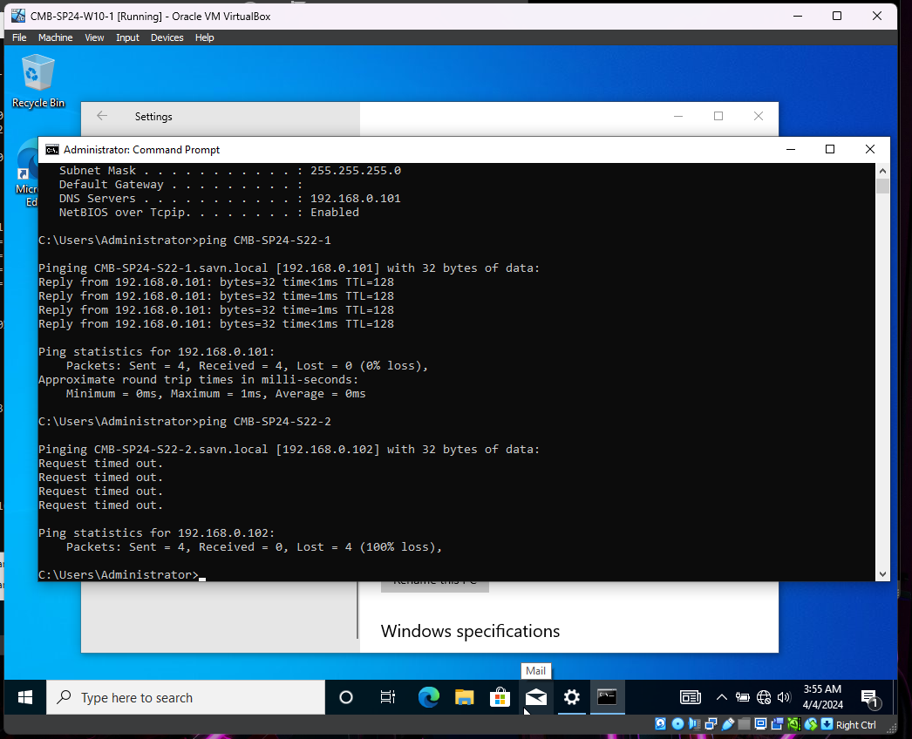


### ipconfig /all CMB-SP24-S22-1
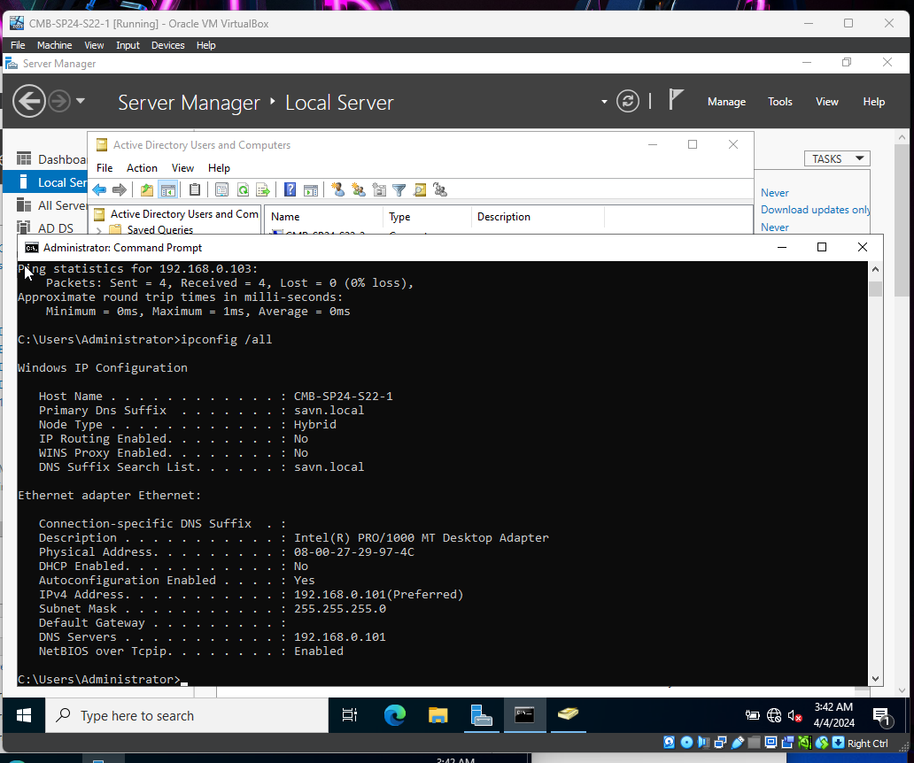


### ipconfig /all CMB-SP24-S22-2
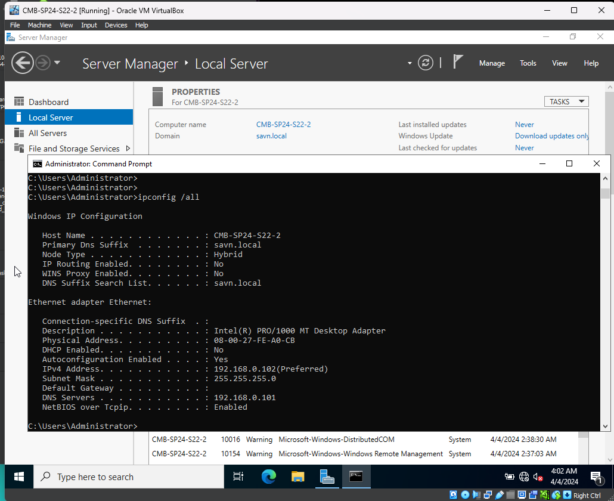


### ipconfig /all CMB-SP24-W10-1
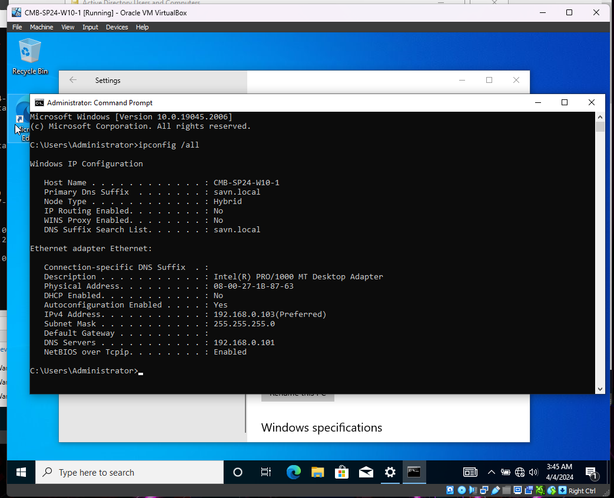


## Header 2

> This is a blockquote following a header.
>
> When something is important enough, you do it even if the odds are not in your favor.

### Header 3

```js
// Javascript code with syntax highlighting.
var fun = function lang(l) {
  dateformat.i18n = require('./lang/' + l)
  return true;
}
```

```ruby
# Ruby code with syntax highlighting
GitHubPages::Dependencies.gems.each do |gem, version|
  s.add_dependency(gem, "= #{version}")
end
```

#### Header 4

*   This is an unordered list following a header.
*   This is an unordered list following a header.
*   This is an unordered list following a header.

##### Header 5

1.  This is an ordered list following a header.
2.  This is an ordered list following a header.
3.  This is an ordered list following a header.

###### Header 6

| head1        | head two          | three |
|:-------------|:------------------|:------|
| ok           | good swedish fish | nice  |
| out of stock | good and plenty   | nice  |
| ok           | good `oreos`      | hmm   |
| ok           | good `zoute` drop | yumm  |

### There's a horizontal rule below this.

* * *

### Here is an unordered list:

*   Item foo
*   Item bar
*   Item baz
*   Item zip

### And an ordered list:

1.  Item one
1.  Item two
1.  Item three
1.  Item four

### And a nested list:

- level 1 item
  - level 2 item
  - level 2 item
    - level 3 item
    - level 3 item
- level 1 item
  - level 2 item
  - level 2 item
  - level 2 item
- level 1 item
  - level 2 item
  - level 2 item
- level 1 item

### Small image


### Large image


### Definition lists can be used with HTML syntax.

<dl>
<dt>Name</dt>
<dd>Godzilla</dd>
<dt>Born</dt>
<dd>1952</dd>
<dt>Birthplace</dt>
<dd>Japan</dd>
<dt>Color</dt>
<dd>Green</dd>
</dl>

```
Long, single-line code blocks should not wrap. They should horizontally scroll if they are too long. This line should be long enough to demonstrate this.
```

```
The final element.
```
